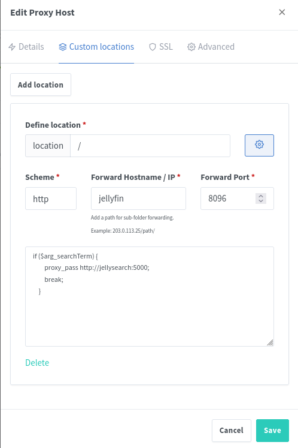

# Fork from https://gitlab.com/DomiStyle/jellysearch

# JellySearch

## 增加歌词搜索功能

> [!CAUTION]
> The search may return results from libraries that the user is not authorised to view. Search results are not checked for user permissions. see https://gitlab.com/DomiStyle/jellysearch/-/issues/16

A fast full-text search proxy for Jellyfin. Integrates seamlessly with most Jellyfin clients.

## How does it work?
JellySearch keeps a separate index of the Jellyfin SQLite database inside of Meilisearch. It keeps the index in sync with Jellyfin with a cronjob.

When a search request is made by a Jellyfin client, the request is forwarded to JellySearch instead of directly to Jellyfin by the reverse proxy.

JellySearch will then search and filter by the input query in Meilisearch and forward the found items to Jellyfin, resulting in a great speed up of search queries.

On a large Jellyfin server this brings the search speed per request down from about 2 seconds to 1 - 150 milliseconds.

As an added bonus, the search is much less prone to not finding results because of typos and also supports searching across multiple fields, e.g. `mr robot`, `how to train your dragon 2010`, `queen a night at the opera`, `brotherhood fullmetal`, `better cal sual` all work.

## Requirements
* Jellyfin running inside of Docker
* Jellyfin running behind a reverse proxy
* JellySearch needs read access to the Jellyfin database

Running outside of Docker works but you're on your own right now. If you get it working feel free to put in a PR detailing how it works.

## Tested clients
### Working

* Web client
* Jellyfin for Android
* Jellyfin for Android TV
* Finamp (Android & Linux)
* Findroid
* Delfin
* Gelli
* Jellyfin Vue*

\* Works but is still pretty slow

### Currently not working

* Audio books and Live TV were not tested
* Genre searches are currently not working and are passed along directly to the Jellyfin server
* If you have an exotic client which can do filtering and searching at the same time, this will probably break things

## Setup

### Setting up JellySearch
Besides JellySearch, you need a running MeiliSearch instance. If you use docker compose you can simply add 2 new services:

```
  jellysearch:
    image: domistyle/jellysearch
    restart: unless-stopped
    volumes:
      - config:/config:ro
    environment:
      MEILI_MASTER_KEY: "1234"
      INDEX_CRON: "0 0 0/2 ? * * *"
    labels:
      - traefik.enable=true
      - traefik.http.services.jellysearch.loadbalancer.server.port=5000

      - traefik.http.routers.jellysearch.rule=Host(`demo.jellyfin.org`) && (QueryRegexp(`searchTerm`, `(.*?)`) || QueryRegexp(`SearchTerm`, `(.*?)`))
  meilisearch:
    image: getmeili/meilisearch:v1.9
    restart: unless-stopped
    volumes:
      - meilisearch:/meili_data
    environment:
      MEILI_MASTER_KEY: "1234"
```

* `/config` should be the same directory that is mounted to your Jellyfin config directory
  * Only read permission is needed
* `MEILI_MASTER_KEY` can be any random string which is used for authentication between JellySearch and Meilisearch
  * Make sure they are identical
* `INDEX_CRON` determines at which interval the index is updated
  * e.g. `0 0 0/2 ? * * *` for every 2 hours and `0 0 4 ? * * *` for 4 in the morning every day
  * See the Quartz.NET documentation for valid values: https://www.quartz-scheduler.net/documentation/quartz-3.x/tutorial/crontrigger.html
* `demo.jellyfin.org` should be your Jellyfin host
    * Depending on which reverse proxy you use, that config might be located somewhere else (see below)

You might have to set more environment variables if your container names differ:

| Variable | Description | Default value | Required |
| -------- | ----------- | ------------- | -------- |
| JELLYFIN_URL | The full URL of your Jellyfin instance. | `http://jellyfin:8096` | Yes |
| JELLYFIN_CONFIG_DIR | The directory where you mounted the config folder of your Jellyfin instance. | `/config` | Yes |
| INDEX_CRON | The cron schedule to run the reindexing at, will not reindex automatically without it set. (see https://www.quartz-scheduler.net/documentation/quartz-3.x/tutorial/crontrigger.html) | `null` | No |
| MEILI_URL | The URL where your Meilisearch instance is reachable. | `http://meilisearch:7700` | Yes |
| MEILI_MASTER_KEY | The key used to authenticate with Meilisearch. | `null` | Yes |

### Setting up the reverse proxy
The reverse proxy should be set up in a way which forwards every request that contains the query argument `searchTerm` (case-insensitive!). Search requests to `/Genres` are automatically forwarded to Jellyfin, they are currently not supported.

#### Traefik
In Traefik you can simply add a new rule to the JellySearch container:

```
  - traefik.http.routers.jellysearch.rule=Host(`demo.jellyfin.org`) && (QueryRegexp(`searchTerm`, `(.*?)`) || QueryRegexp(`SearchTerm`, `(.*?)`))
```

**Traefik 3.0 or higher is required since support for `QueryRegexp` is missing in Traefik 2.0.**

Make sure `demo.jellyfin.org` is your Jellyfin host and is identical between your Jellyfin and JellySearch containers.

#### nginx

When using the default nginx Jellyfin config (https://jellyfin.org/docs/general/networking/nginx/), add the following block on the top inside of your Jellyfin `location /` nginx config block:

```
    if ($arg_searchTerm) {
        proxy_pass http://jellysearch:5000;
        break;
    }
```

It should look like this:

```
...

    location / {
        # Proxy JellySearch
        if ($arg_searchTerm) {
            proxy_pass http://jellysearch:5000;
            break;
        }

        # Proxy main Jellyfin traffic
        proxy_pass http://$jellyfin:8096;
        proxy_set_header Host $host;
        proxy_set_header X-Real-IP $remote_addr;
        proxy_set_header X-Forwarded-For $proxy_add_x_forwarded_for;
        proxy_set_header X-Forwarded-Proto $scheme;
        proxy_set_header X-Forwarded-Protocol $scheme;
        proxy_set_header X-Forwarded-Host $http_host;

        # Disable buffering when the nginx proxy gets very resource heavy upon streaming
        proxy_buffering off;
    }

...
```

#### Nginx Proxy Manager

On NPM edit the Jellyfin proxy host and add a new custom location on `/`, set the forward hostname/IP and scheme/port to where your Jellyfin instance is running. After that click on the cog and paste the following extra rule:

```
if ($arg_searchTerm) {
    proxy_pass http://jellysearch:5000;
    break;
}

```



#### Other
In principle any reverse proxy which can redirect certain paths and/or query parameters to a different backend should work.
